<!--
  Wenn du das hier liest: Respekt. Neugier ist eine Tugend.
  Meld dich gerne: https://dbw-media.de
-->



---


---

### 🎮 Capstone Project — Pokémon Battler

Ein vollständig browserbasierter Pokémon-Kampfsimulator — mit echten Gen-1-Moves, Typen-Matchups und dem ganzen Nostalgie-Faktor.

**➜ [pokemon-battler.dennisbuchwald.de](https://pokemon-battler.dennisbuchwald.de/)** · [GitHub Repo](https://github.com/dennisbuchwald/capstone-project-pokemon-battler)

---

### 🛠 Tech Stack

```
╭──────────────────────────────────────────────╮
│  Frontend    →  HTML · CSS/SCSS · JavaScript │
│  Frameworks  →  React · Next.js              │
│  CMS         →  WordPress · PHP              │
│  Automation  →  n8n                          │
│  Tooling     →  Webpack · Vite · Git         │
╰──────────────────────────────────────────────╯
```

---

### Let's connect.

[](https://dbw-media.de)
[](https://www.instagram.com/dennisbuchwald)
[](https://www.linkedin.com/in/dennisbuchwald/)
